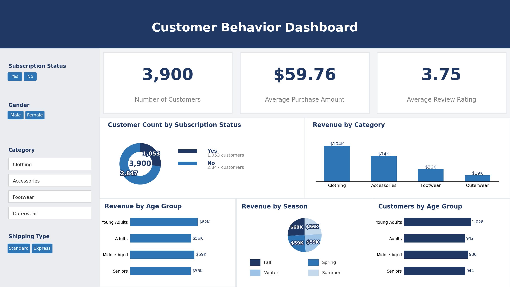

# Customer Shopping Behavior Analysis

End-to-end data analytics project on a 3,900-row retail apparel dataset — from raw data to a decision-ready dashboard. Built to demonstrate the full analyst workflow: **Python (EDA & cleaning) → SQL Server (business querying) → Power BI (dashboarding)**.



## 📌 Overview

| | |
|---|---|
| **Objective** | Identify the customer, product, and behavioral factors driving revenue and loyalty for a retail apparel business |
| **Dataset** | 3,900 transactions × 18 columns — demographics, purchase details, engagement signals, fulfillment details |
| **Tools** | Python (pandas), Microsoft SQL Server, Power BI |
| **Deliverables** | Cleaned dataset, 10 SQL business-question queries, interactive Power BI dashboard, PDF project report |

## 🔑 Key Results

- **$233,081** total revenue across **3,900** customers, **$59.76** average order value, **3.75 / 5** average review rating
- **70%** of customers are "Loyal" (16+ prior purchases) — but only **27%** are active subscribers, revealing a clear retention-to-subscription conversion gap
- **72%** of high-frequency repeat buyers (5+ purchases) are *not* subscribed — the single largest actionable opportunity in the data
- Gender revenue gap ($157,890 male vs. $75,191 female) tracks the customer base composition (68/32 split), **not** a real difference in per-customer spend (avg. order value is ~$59–60 for both)

## 🛠️ Workflow

**1. Data Cleaning & Feature Engineering (Python / pandas)**
- Imputed missing review ratings using the median rating within each product category
- Standardized column headers to snake_case for consistency across tools
- Engineered `age_group` (quartile-based cohorts) and `frequency_days` (numeric purchase cadence)
- Identified and dropped `promo_code_used` as 100% redundant with `discount_applied`
- Loaded the cleaned dataset into SQL Server via SQLAlchemy

**2. Business Querying (SQL Server)**
Ten business questions answered using `GROUP BY` aggregations, subqueries, CTEs, and window functions (`ROW_NUMBER`) — see [`sql/Customer_ques.sql`](sql/Customer_ques.sql):
- Revenue by gender, category, age group, and season
- Discount-usage patterns and high-spending customer identification
- Top-rated and best-selling products (overall and per category)
- Subscriber vs. non-subscriber spend comparison
- Customer segmentation (New / Returning / Loyal) by purchase history
- Repeat-buyer subscription conversion analysis

**3. Dashboarding (Power BI)**
A single-page interactive dashboard (`dashboard/Customer_Behaviour.pbix`) with:
- KPI cards for headline metrics
- Revenue breakdowns by category, age group, and season
- Subscription-status donut chart
- Cross-filtering slicers (gender, category, subscription status, shipping type)

## 📁 Repository Structure

```
customer-behavior-analysis/
├── README.md
├── data/
│   └── customer_shopping_behavior.csv
├── notebooks/
│   └── analysis.ipynb              # EDA & cleaning
├── sql/
│   └── Customer_ques.sql           # 10 business-question queries
├── dashboard/
│   ├── Customer_Behaviour.pbix     # Power BI dashboard
│   └── dashboard_preview.png       # Static preview image
└── report/
    └── Customer_Behavior_Project_Report.pdf   # Full write-up with findings & recommendations
```

## 🚀 Reproducing This Analysis

1. Clone the repo and install dependencies: `pip install pandas sqlalchemy pyodbc`
2. Run `notebooks/analysis.ipynb` to clean the raw CSV and (optionally) load it into a local SQL Server instance
3. Run the queries in `sql/Customer_ques.sql` against the cleaned table
4. Open `dashboard/Customer_Behaviour.pbix` in Power BI Desktop to explore interactively

## 📄 Full Report

See [`report/Customer_Behavior_Project_Report.pdf`](report/Customer_Behavior_Project_Report.pdf) for the complete write-up, including methodology, all 10 findings with charts, and business recommendations.

---
*Author: Sarthak*
